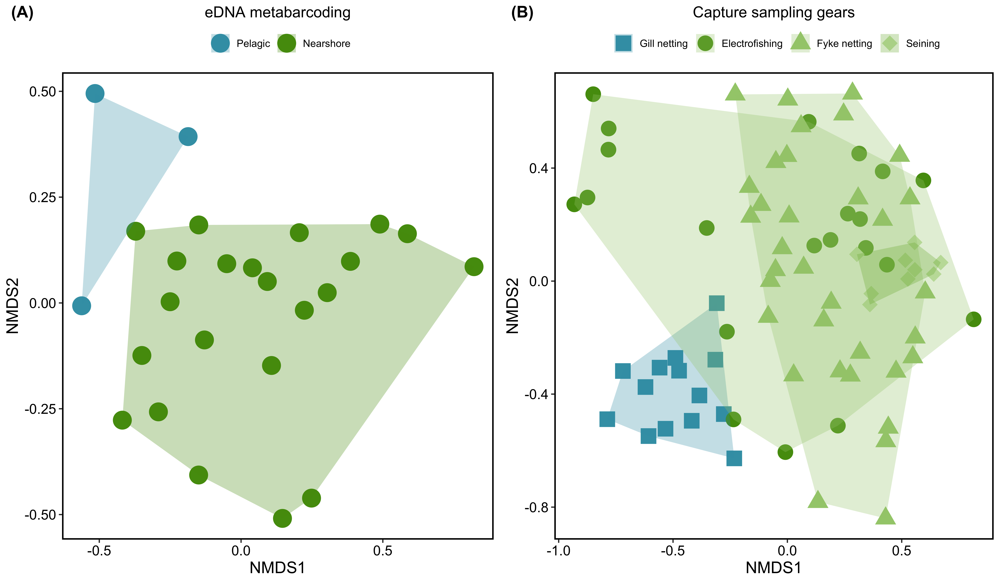
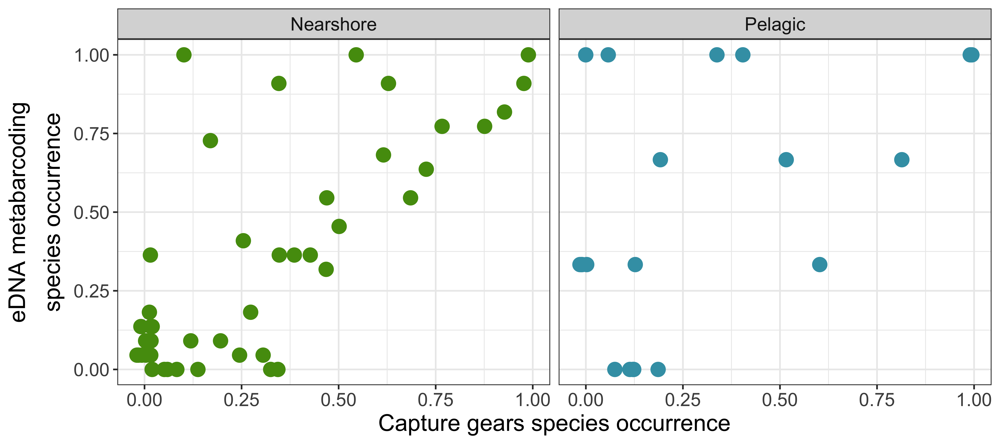

```{r setup, include=FALSE}
knitr::opts_chunk$set(echo = TRUE)
```

### Project overview

  Metabarcoding of aquatic environmental DNA (eDNA) is a sensitive detector of biodiversity, but there remains uncertainty regarding its ability to provide complete species inventories and reveal spatial patterns of biodiversity. In this study, we compared eDNA and traditional sampling surveys in a well-studied lake to evaluate the suitability of fish-based eDNA metabarcoding for (1) performing lake-wide species inventories and (2) characterizing within-lake spatial patterns in community composition and relative abundances.

### Oneida Lake

  Oneida Lake (New York, USA) is a large, shallow inland lake with a total surface area of surface area of 206.7 km^2 and a maximum depth of 16.8 m (mean depth = 6.8 m). Lake depth follows an east to west gradient, becoming narrower and shallower toward the outlet on the west end of the lake (Figure 1). Research at the Cornell Biological Field Station (CBFS), supported by Cornell University and the New York Department of Environmental Conservation, has intensively focused on the populations, fisheries, and limnology of Oneida Lake since the station was established in 1956. The resulting datasets are recognized as some of the best long term data series in aquatic ecology. As of 2016, historical records documented 85 species of fish in Oneida Lake and its tributaries, comprising 52 genera and 22 families. Of these, 77 species have been documented in the lake or tributaries since 1990. The New York State Oneida Hatchery is located on the north shore of Oneida Lake, where surplus water from holding tanks is discharged into Scriba Creek, a tributary of Oneida Lake (Figure 1). At the time of this study, walleye (*Sander vitreous*) and lake sturgeon (*Acipenser fulvescens*) were being raised at the facility.

 <center>
{width=90%}
</center>
**Figure 1.** Map of eDNA sampling and traditional survey locations in Oneida Lake, NY, USA. Colors and symbols represent the sampling locations for different gear types. White lines connect the start and end points of each electrofishing transect. The black star denotes the location of the Oneida Hatchery with outflow into a lake tributary. 

### Traditional sampling

  Standardized monitoring surveys of Oneida Lake fish populations are conducted annually using a combination of sampling gears including electrofishing, gill nets, fyke nets, and seining. Although all captured species are identified, each survey method is focused on sampling either the nearshore fish community (electrofishing, fyke net, seining) or the pelagic fish community (gill net). 
  
  * Shoreline electrofishing surveys were conducted from June 12–28, 2017 at each of eight transects spanning the perimeter of the lake and representing typical shoreline habitats.
  * Gill net surveys were conducted at a different standard site each week for 15 consecutive weeks from June 8–September 12, 2017.
  * Fyke nets were deployed at 18 sites between September 19–27, 2017.
  * Seine sampling occurred at each of nine sites located within a limited area of the southern lake near the CBFS harbor. Each site was sampled monthly from July–September, 2017. 
	
### eDNA sampling, library prep, and bioinformatics

  We collected 2-L eDNA samples at nearshore, mid-lake (pelagic), and tributary habitats on June 13, 2017. Nearshore eDNA samples were collected at the start and end of each electrofishing transect (16 locations), as well as at three mid-lake locations and at the inlets of Oneida Creek,  Fish Creek, Big Bay Creek, and Chittenango Creek. Two additional nearshore eDNA samples were collected to total 25 eDNA samples. Water samples were filtered onto 1 µm cellulose-nitrate filters (47 mm diameter) and DNA extracted using DNeasy Blood and Tissue extraction kits. NGS libraries were prepared in a two-step process: 1) universal fish primers (MiFish-U-F: GTCGGTAAAACTCGTGCCAGC; MiFish-U-R: CATAGTGGGGTATCTAATCCCAGTTTG; [Miya et al., 2015](https://royalsocietypublishing.org/doi/10.1098/rsos.150088)) targeted a hypervariable region of the 12S rRNA gene (163–185 bp), and 2) Illumina Nextera XT tags identified each sample. The libraries were paired-end sequenced with the NextSeq 500 Mid output kit (2×150 bp).

  We supplemented the 12S NCBI reference database by sequencing tissues from two species that were not represented: round goby (*Neogobius melanostomus*) and greater redhorse (*Moxostoma valenciennesi*). DNA was extracted from fin clips sampled from 2–3 individuals per species, which was then amplified and sequenced using Sanger Sequencing.

  Sequence reads were analyzed to obtain 12S amplicon sequence variants (ASVs) and the associated read counts for each sample. Degenerate bases and adaptors were trimmed from demultiplexed paired reads and sequences < 35 bp were removed using Trimmomatic. Sequences were then analyzed using DADA2, which involved removing forward and reverse primers, trimming reads to 126 bp, and discarding sequences with expected number of errors > 2, (EE, calculated based on Phred scores). Sequences were denoised using the DADA2 error filtering algorithm, which identifies and discards erroneous sequences based on error models learned from each FASTQ file (i.e. sample). Forward and reverse reads were merged with a minimum overlap of 20 bp and a maximum of one accepted error in the overlap region, and putative chimeras were removed.  

  Taxonomic assignments for each ASV were obtained using the BLASTn algorithm and the nucleotide and taxonomy (nt/taxdb) databases from NCBI. We retained five target sequences for each ASV and assigned species-level taxonomy to ASVs that matched a single species with a sequence identity of ≥ 98%. If multiple species matched the query sequence equally well, ASVs were assigned the lowest common taxonomic rank (genus or family) among the target sequences with equal percent identity. ASVs that could not be classified to the family level were excluded from further analysis. ASVs with taxonomic assignments were filtered by removing ASVs with read counts < 0.1% of all reads in a sample or with fewer than the average number of non-zero reads summed across all negative controls (23 reads). Non-target species including non-fish and marine species were removed from the dataset.

### Lake-wide comparisons  

  A total of 2,982 unique ASVs were identified in the eDNA metabarcoding data, of which 2,351 were assigned taxonomy at the species level, 611 at the genus level, and 20 to the family level. Only one sequence was unable to be resolved to at least the family level.

  Species inventories for all traditional gear types and eDNA metabarcoding were compared at the lake-wide scale, habitat type scale, and site scale. For the lake-wide species inventory, we compared species richness observed with eDNA metabarcoding to traditional sampling gears, where species richness was measured both separately and by grouping all traditional gears together. We also included a comparison to Oneida Lake historical species records, which include lake-wide and watershed (including tributaries) species inventories since 1990. Lake-wide species accumulation curves were constructed for each sampling method using the “exact” method, which calculates the mean species richness per site.
  
  Across all eDNA samples, a total of 40 unique species and 7 unique genus- or family- level taxonomic assignments were identified. Total species richness detected in eDNA samples was higher than electrofishing (30), gill nets (14), fyke nets (27), and seine nets (27), as well as all traditional sampling gears combined (35). Ten species known to be present in Oneida Lake from the historical dataset were detected with eDNA but none of the traditional sampling gears. 

 <center>
{width=70%}
</center>
**Figure 2.** (A) Species accumulation curves for eDNA sampling and traditional sampling methods. (B) Overlap of occurrences for all detected taxa among sampling approaches (electrofishing vs. eDNA metabarcoding) and historical datasets.
$$\\[0.1in]$$

  Although lake-wide species inventories using eDNA look promising, lake-wide species abundance (eDNA read counts and fish catch numbers) show very different species proportions. For simplicity, only the top 8 species per sampling method are shown here: 
  
 <center>
{width=90%}
</center>
**Figure 3.** Proportional read counts (eDNA) and species counts (traditional sampling gears) for the 8 most common species sampled per gear type across all sites.

### Habitat-scale comparisons

  Species inventories at the scale of habitat type involved grouping all sampled sites into nearshore, pelagic, and tributary habitats and calculating species richness for each sampling gear, where we used eDNA to sample all three habitats, gill nets to sample pelagic habitats, and a combination of electrofishing, fyke nets, and seine nets to sample nearshore habitats. The historical dataset includes a species inventory of Oneida Lake tributaries. 


 <center>
{width=70%}
</center>
$$\\[0.1in]$$
  Non-metric multidimensional scaling (NMDS) was used to visualize differences in species composition among habitat types based on Sorensen dissimilarity indices calculated from species presence-absence for eDNA metabarcoring and traditional sampling gears. 
$$\\[0.1in]$$
 <center>
{width=90%}
</center>
**Figure 4.** NMDS plot of species presence-absence for eDNA and traditional datasets. Colors represent habitat types, with eDNA samples taken in all three habitats, and traditional sampling methods conducted in pelagic (blue, gill nets) and nearshore habitats (green; electrofishing, fyke nets, and seine nets). Dissimilarity indices were computed using the Sørensen index.
  
  $$\\[0.1in]$$
  For nearshore and pelagic habitats, we calculated the proportion of eDNA samples and traditional survey sites each species was present and tested the association between species occurrence using Kendall’s rank correlation coefficient. The proportion of sites each species was present was significantly correlated in nearshore habitats (r = -0.36, p = 0.379) but not in pelagic habitats (r = -0.36, p = 0.379). Investigating some outlying species revealed that "false" positives in eDNA were the result of gear bias (gill nets do not adequately sample gobies) or idiosyncrasies in data collection (they don't count carp caught by traditional methods). "False" negatives were generally the result of poor species-level resolution in the reference database.
  
  $$\\[0.1in]$$
 <center>
{width=90%}
</center>
**Figure 5.** Relationship between species occurrences (proportion of sites/samples where each species was detected) obtained with metabarcoding and all traditional methods combined. Samples are separated by habitat type, where nearshore habitats (A) include species detected with electrofishing, fyke nets, and seine nets, and pelagic habitats include species detected with gill nets. 

### Site-level comparisons

  Because eDNA samples were collected at the start and end of each of eight electrofishing transects, site-level comparisons are only conducted between eDNA and electrofishing datasets. All samples are in nearshore habitats, with 2 eDNA samples and 3 electrofishing runs combined per transect. eDNA detected more species than electrofishing at six of eight transects, with higher mean species richness (mean,sd = 21.63, 5.55) than electrofishing (mean,sd = 17.88, 4.09) across all sites, although this difference was not significant (Wilcoxon test, p = 0.291). The number of species detected per site from eDNA and electrofishing was also not significantly correlated (r = -0.36, p = 0.29). 

<center>
{width=70%}
</center>
**Figure 5.** Species richness per transect for paired eDNA/electrofishing samples.  
$$\\[0.1in]$$
  To explore the relationship between site-level eDNA read counts and fish abundance collected using electrofishing, we calculated Kendall's rank correlations between proportional eDNA read counts and proportional catch numbers for each species at each of the 8 sites (electrofishing transects). Correlation coefficients ranged from -0.32 to 1.00, with a mean of 0.17. Only 3 of 28 correlations were significant at p = 0.05.

<center>
{width=70%}
</center>
**Figure 6.** Histogram of correlation coefficients between proportional read counts (eDNA) and proportional catch numbers (electrofishing) per each species. Vertical line indicates mean correlation coefficient across all species (r=0.17).

### Questions for the group

Some things I have been pondering:

1) Sampling biases occur in all gear types with varying degrees of selectivity, specificity, and efficiency. The sampling methods used in this study also vary in their relative effort (number of sites) and temporal/spatial extent. Moreover, species resolution varies across sampling methods depending on the taxonomic expertise of the collectors (in traditional surveys) and completeness of the reference database (metabarcoding). Because we *expect* differences among sampling types, what is the value in detecting differences among them?

2) My sense is that the story may be more compelling and interpretable if we combine all traditional gears into a single dataset for comparison to eDNA. What are the best practices to account for differences among sampling methods in terms of effort and temporal/spatial scale?

3) Is breaking down the analyses into 3 spatial extents (lake-wide, habitat, site) useful? Is there anything in particular that is confusing or unclear about grouping the analyses in this way? An alternative way to present the analyses could be species presence-absence vs. relative proportions.
